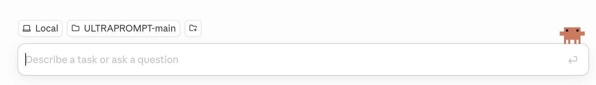
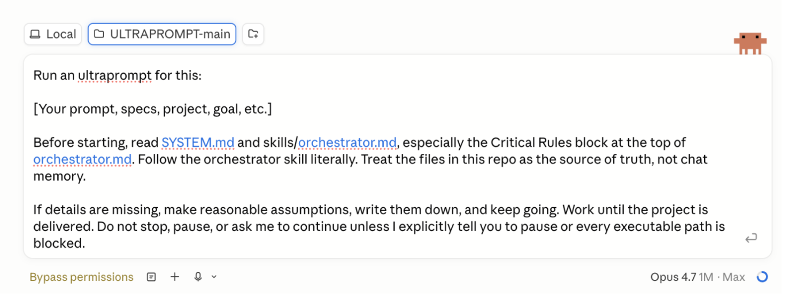

<div align="center">

# ULTRAPROMPT

### The project manager for serious AI agent work.

ULTRAPROMPT turns one big prompt into a planned, tracked, resumable project, then keeps agents moving until the work is proven done.

AI agents are powerful, but long projects get messy. ULTRAPROMPT keeps the plan, tickets, checkpoints, evidence, and resume state organized across Codex, Claude Code, OpenCode, or any capable coding agent.

[](pyproject.toml)
[](https://github.com/ULTRAPROMPT-BUILD/ULTRAPROMPT/actions/workflows/ci.yml)
[](LICENSE)
[](#project-status)


**Built for people who want AI agents to finish real work, not stop at a confident first draft.**

[Start](#start-in-five-minutes) · [Starter Prompt](#starter-prompt) · [Better Prompts](#make-the-prompt-stronger) · [Resume](#resume-after-any-interruption) · [Proof](#what-makes-it-different) · [Architecture](docs/ARCHITECTURE.md) · [Setup](docs/SETUP.md)

</div>

---

## What Makes It Different

- **It keeps AI projects organized.** Agents execute the work; ULTRAPROMPT manages the plan, tickets, evidence, checkpoints, and delivery state.
- **Progress does not disappear.** Plans, tickets, decisions, evidence, and status files live on disk, so work can resume after context limits, restarts, pauses, or model switches.
- **Big work becomes manageable.** One prompt can turn into hours, days, or weeks of structured work because ULTRAPROMPT breaks the project into phases, tickets, gates, and checkpoints.
- **The finish line is defined up front.** ULTRAPROMPT can research current context, set acceptance criteria, define the quality bar, and apply deliverable standards before the agent builds.
- **Done means proven.** Tickets close only with real evidence such as files, command output, tests, screenshots, reports, reviews, or release checks.
- **It can add tools when the work needs them.** ULTRAPROMPT can source or build MCP servers, skills, and helper tools, then archive them for reuse.

You do not need to understand MCPs, vaults, tickets, gates, or routing before your first run. The setup path is intentionally plain: install one AI coding tool, clone or download this repo, run bootstrap, open the folder, paste the prompt.

## Built With ULTRAPROMPT

The largest project built end-to-end through ULTRAPROMPT to date was a production-grade cross-platform database client with Tauri v2, React 19, Rust, PostgreSQL, SQLite, DuckDB, CSV/XLSX support, and enterprise security features.

From one prompt, ULTRAPROMPT drove about **6 days** of work, about **200 tickets**, and roughly **130,000 lines** of TypeScript, Rust, Python, configs, and supporting code.

## Start In Five Minutes

### 1. Install an AI coding tool

Install and sign in to one of these:

- [Claude Code](https://claude.com/claude-code)
- [Codex CLI](https://github.com/openai/codex)
- [OpenCode](https://opencode.ai/)
- Another compatible AI coding tool

One authenticated tool is enough. A compatible tool can be a CLI, a VS Code-style editor agent, a desktop app, or a GUI agent as long as it can open this folder, read and edit files, run shell commands, and follow long repo instructions. A plain web chat without repo and terminal access is not enough. Claude Code and Codex have the most tested routing support; OpenCode, editor agents, desktop apps, and other tools can still run ULTRAPROMPT chat-native by opening this folder and pasting the starter prompt.

By default, ULTRAPROMPT runs chat-native on whichever tool you open it in. That means reviews are cross-context by default, not necessarily cross-model. Advanced users can customize routing to mix Claude, Codex, OpenCode, local models, or other tools when they want stronger model diversity.

### 2. Clone or download ULTRAPROMPT

With Git:

```bash
git clone https://github.com/ULTRAPROMPT-BUILD/ULTRAPROMPT
cd ULTRAPROMPT
```

Without Git: use GitHub's **Code -> Download ZIP**, unzip it, and open the folder that contains `README.md`, `SYSTEM.md`, and `skills/orchestrator.md`.

### 3. Run bootstrap

This installs the small `ultraprompt` helper and creates local config files from examples. It checks readiness; it does not run your project.

```bash
python3 -m venv .venv
source .venv/bin/activate
pip install --upgrade pip
pip install -e .
ultraprompt
```

The bootstrap copies `.env.example`, `.mcp.example.json`, and `vault/clients/_registry.example.md` into local working files if they are missing, then checks for `claude`, `codex`, or `opencode` on your PATH.

### 4. Open the folder

Open the ULTRAPROMPT folder in your AI coding tool.

Terminal users can start from inside the repo:

```bash
claude
```

or:

```bash
codex
```

or:

```bash
opencode
```

Desktop app, editor, and GUI users should choose the repo folder itself, not its parent folder.



### 5. Paste the starter prompt

Use the template below. Replace the bracketed line with the thing you want built, researched, designed, analyzed, or delivered.

## Starter Prompt

```text
Run an ultraprompt for this:

[Your prompt, specs, project, goal, etc.]

Before starting, read SYSTEM.md and skills/orchestrator.md, especially the Critical Rules block at the top of orchestrator.md. Follow the orchestrator skill literally. Treat the files in this repo as the source of truth, not chat memory.

If details are missing, make reasonable implementation assumptions, record them in the project file, and keep going.

Do not reduce scope, quality, proof requirements, user-facing polish, or delivery obligations unless I explicitly approve that change. Do not reinterpret the request as a prototype, draft, MVP, plan, scaffold, partial implementation, or "best effort" unless those words are in my request.

When ambiguity exists, do not choose the smaller or easier interpretation. Preserve the full stated goal and deliver the most complete version consistent with my request. If an ambiguity affects scope, quality, proof, polish, or delivery, record the assumption and continue on the path that maintains or increases the requested outcome. Tickets and amendments may clarify or add work; they may not reduce, defer, or downgrade the requested outcome without my explicit approval.

Work until the project is delivered: all acceptance criteria satisfied, required proof gathered, final review passed, and deliverables handed off. Stop only if I explicitly pause/kill the run, or if every executable path is blocked by a legal, credential, approval, physical-world, or safety constraint. In that case, write a complete blocker report listing every blocked path and exactly what is needed to unblock each one.
```



That is the core workflow: **clone or download -> bootstrap -> open folder in your AI coding tool -> paste prompt -> let it work.**

## Make The Prompt Stronger

ULTRAPROMPT works best when you define the finish line. Add these five fields:

- **Goal:** the concrete outcome you want.
- **Audience:** who will use, judge, or approve the result.
- **Done means:** specific acceptance criteria.
- **Constraints:** stack, style, budget, deadline, required files, and things to avoid.
- **Proof:** tests, screenshots, demos, citations, reports, reviews, or release checks you expect.

Example:

```text
Run an ultraprompt for this:

Build a polished local-first personal finance dashboard for a non-technical user.

Audience: someone who wants a private budgeting tool, not an accounting system.

Done means: a working app, clear setup instructions, sample data, screenshots, and a verification report showing CSV import, categorization, monthly charts, and PDF export all work.

Constraints: use a boring maintainable stack, avoid paid APIs, keep the UI calm and easy to understand, and do not send financial data to external services.

Proof: run the app locally, test the import flow, capture screenshots of the dashboard, verify PDF export, and summarize every command or check used.

Before starting, read SYSTEM.md and skills/orchestrator.md, especially the Critical Rules block at the top of orchestrator.md. Follow the orchestrator skill literally. Treat the files in this repo as the source of truth, not chat memory.

If details are missing, make reasonable implementation assumptions, record them in the project file, and keep going.

Do not reduce scope, quality, proof requirements, user-facing polish, or delivery obligations unless I explicitly approve that change. Do not reinterpret the request as a prototype, draft, MVP, plan, scaffold, partial implementation, or "best effort" unless those words are in my request.

When ambiguity exists, do not choose the smaller or easier interpretation. Preserve the full stated goal and deliver the most complete version consistent with my request. If an ambiguity affects scope, quality, proof, polish, or delivery, record the assumption and continue on the path that maintains or increases the requested outcome. Tickets and amendments may clarify or add work; they may not reduce, defer, or downgrade the requested outcome without my explicit approval.

Work until the project is delivered: all acceptance criteria satisfied, required proof gathered, final review passed, and deliverables handed off. Stop only if I explicitly pause/kill the run, or if every executable path is blocked by a legal, credential, approval, physical-world, or safety constraint. In that case, write a complete blocker report listing every blocked path and exactly what is needed to unblock each one.
```

## What Happens Next

ULTRAPROMPT plans the project, assigns tickets, coordinates agents, checks proof, catches drift, and keeps going until delivery:

1. Reads the operating instructions in `SYSTEM.md` and `skills/orchestrator.md`.
2. Creates a project contract with goals, assumptions, acceptance criteria, and proof strategy.
3. Gathers current research when the project depends on recent tools, APIs, vendors, or best practices.
4. Breaks active work into phases and just-in-time ticket files.
5. Assigns focused tickets to the active agent tool.
6. Verifies work with evidence from the filesystem, commands, tests, screenshots, reports, citations, or reviews.
7. Writes checkpoints and status files so the next session can resume.

Project execution is chat-native. There is no hidden daemon and no `ultraprompt run` command. The `ultraprompt` CLI is only a bootstrap and readiness helper.

For the deeper system design, read [docs/ARCHITECTURE.md](docs/ARCHITECTURE.md).

## Watch Progress

The agent creates a project slug from your goal. If you do not know it, ask: "What project slug are you using?"

Quick status:

```text
vault/projects/<project-name>.derived/status.md
```

Canonical project log:

```text
vault/projects/<project-name>.md
```

The status file is the quick view. The project file is the durable log with decisions, checkpoints, blockers, and ticket history.

## Resume After Any Interruption

Token limits, rate limits, app restarts, machine restarts, and pauses are normal. Start your AI coding tool again in the same ULTRAPROMPT folder and paste:

```text
Resume the active ultraprompt in this repo. Do not create a new project.

Read SYSTEM.md and skills/orchestrator.md, especially the Critical Rules block at the top of orchestrator.md. Inspect vault/projects/*.md and the matching vault/projects/*.derived/status.md files, identify the active project, find the latest ORCH-CHECKPOINT, restore the current state from disk, and continue the project to delivery. Do not restart from scratch unless the project file says to. If more than one active project exists, ask me which one to resume.
```

## What Is Included

- `SYSTEM.md` and `skills/orchestrator.md`: the core operating instructions.
- `skills/`: prompts for orchestration, project planning, research context, creative briefs, ticketing, deliverable standards, quality checks, capability sourcing, reviews, delivery, and project memory.
- `scripts/`: gate checks, routing helpers, context builders, evidence tools, and release verification helpers.
- `vault/`: disk-backed project memory, tickets, snapshots, decisions, lessons, client workspaces, archived capabilities, and platform config.
- `vault/clients/_platform/mcps/`: bundled MCP servers and API wrappers, including spending controls.
- `tests/`: regression tests for routing, gates, evidence requirements, and project state.
- `docs/`: [architecture](docs/ARCHITECTURE.md), [quickstart](docs/QUICKSTART.md), and [setup](docs/SETUP.md).

## Safety And Cost

ULTRAPROMPT is powerful because agents can read and write files, run shell commands, and call configured APIs. Treat that seriously.

- Review `.env.example` and `.mcp.example.json` before adding credentials. Never commit `.env` or live credentials.
- Use restricted API keys wherever providers support them.
- Configure the spending MCP before giving agents access to paid APIs.
- Use broad edit/run permissions only for trusted local repos after reviewing credentials and config.
- External code and third-party tools should be treated as untrusted until inspected.
- Expect real projects to use many model calls. ULTRAPROMPT optimizes for verified output, not the lowest token count.

## Project Status

Early release. The platform works end-to-end and real projects have shipped through it, but it is not battle-tested across every environment. macOS and Linux are the primary targets; Windows users can try Codex in PowerShell, with WSL2 recommended for the most Linux-like path. Python 3.9+ is required. Node 18+ is recommended for web apps, browser tests, and UI projects.

Security issues: see [SECURITY.md](SECURITY.md).

## Creator

Created by [Michael Zola](https://www.linkedin.com/in/michaeljzola/).

## License

[Apache 2.0](LICENSE). Keep the copyright notice and `NOTICE` file.
