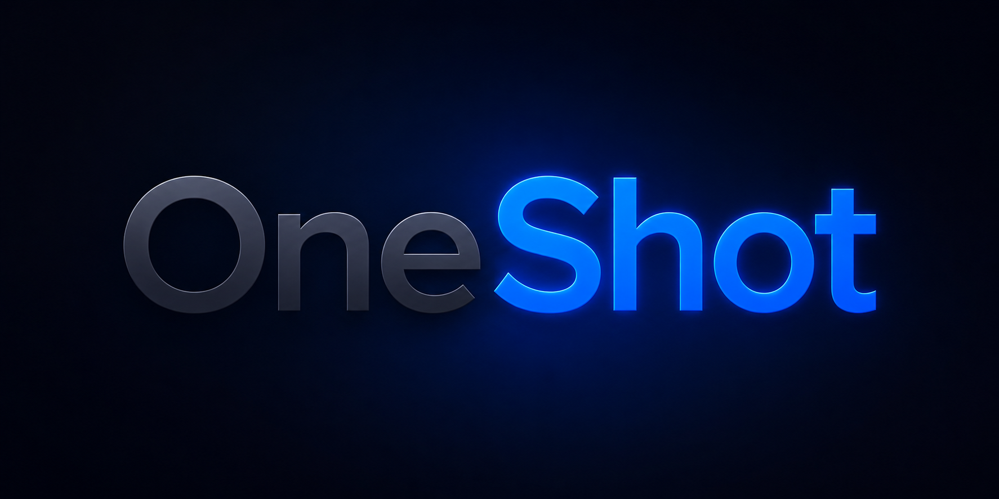

<div align="center">

# OneShot

### One prompt. Full delivery.

A Claude plugin for big AI requests. Ask for the app, game, site, research, cleanup, or migration you want — OneShot keeps Claude working until the result is finished, verified, or blocked by a decision only you can make.

You don't need to learn the project-management plumbing under the hood. You just type `/oneshot`.

[](LICENSE)



[Install](#install) · [Use](#use) · [Examples](#examples) · [Codex](#using-codex) · [Publish](#publishing)

</div>

---

## Why OneShot

A normal Claude chat is great for quick answers. Big work is different — it needs nudging: remember the goal, make the files, run the checks, fix what broke, explain what changed, keep going.

OneShot is for that kind of work. Give Claude one serious prompt and OneShot pushes it to:

- understand what you want
- make reasonable assumptions when details are missing
- keep working past the first draft
- verify the work before handing it back
- stop and tell you clearly when it needs a credential, payment, or human decision
- resume from saved progress if the session is interrupted

It can run for an hour, a day, or across resumed sessions if the job needs it.

## Install

Grab a plugin file from the release:

- `oneshot-claude-plugin-0.1.0.plugin` — plugin upload file
- `oneshot-claude-plugin-0.1.0.zip` — same plugin, zip-packaged

Then:

1. Open Claude Desktop.
2. Go to plugin settings.
3. Upload the OneShot file.
4. Enable OneShot.
5. Open Claude in the folder or project where you want work done.
6. Type `/oneshot` and paste your request.

For Claude, the plugin file is enough. You still need to open Claude in the folder or project it should work on. The full repo is only needed for Codex setup, source review, testing, building, or publishing.

> If the slash menu shows `/oneshot:oneshot`, that's the same plugin under its full namespaced name.

## Use

Start with `/oneshot` and say what you want:

```text
/oneshot build a simple personal budget app with CSV import, charts, setup instructions, screenshots, and proof that the main flows work
```

That's enough to get started. For sharper results, name five things:

- **Goal** — what you want built
- **Audience** — who it's for
- **Done means** — the specific finish line
- **Avoid** — constraints and off-limits choices
- **Proof** — the evidence you want before delivery

Worked example:

```text
/oneshot build a local-first personal finance dashboard.

Audience: a non-technical person who wants private budgeting.

Done: working app, setup instructions, sample data, screenshots, CSV import, spending categories, monthly charts, PDF export.

Avoid: paid APIs, busy design, sending financial data to outside services.

Proof: run it locally, test import/export, capture screenshots, summarize what was checked.
```

## Examples

```text
/oneshot build a small habit-tracking app I can run locally

/oneshot make a playable browser game from this idea, with setup instructions

/oneshot research the best options for this product category and recommend one

/oneshot clean up this project, fix obvious issues, run checks, summarize what changed

/oneshot turn this rough idea into a working first version I can try
```

## What to Expect

OneShot doesn't bypass real limits.

- **File access** — open Claude in the folder or project that holds the files.
- **Credentials, logins, payment, approvals** — OneShot stops and asks rather than guessing.
- **Interrupted session** — reopen the same project and ask Claude to resume the active OneShot.
- **Big asks** — expect real time and real model usage.

The contract is simple: one prompt in, full delivery out.

## Using Codex

Claude is the primary `/oneshot` experience. This section is only for Codex users.

Codex doesn't take a `.plugin` upload or expose a slash command. Instead, register OneShot as a plugin marketplace source:

```bash
codex plugin marketplace add /path/to/OneShot
```

Then open Codex in the project and start with:

```text
Run a OneShot for this:

[your prompt]
```

That triggers the bundled OneShot Codex skill.

## Publishing

If you're packaging or validating OneShot yourself, build the plugin files with:

```bash
scripts/package_claude_plugin.sh
```

Reference docs:

- [Quickstart](docs/QUICKSTART.md)
- [Publishing checklist](docs/PUBLISHING.md)
- [Claude plugin install notes](plugins/claude/oneshot/INSTALL.md)
- [Codex plugin notes](plugins/codex/oneshot/INSTALL.md)

## Safety

OneShot lets Claude read files, edit files, run commands, and use connected tools. Use it in workspaces where you're comfortable with that.

Don't paste secrets, customer data, or payment credentials unless you know exactly where they'll be used.

## License

OneShot is derived from the source project listed in [`NOTICE`](NOTICE). Released under [Apache 2.0](LICENSE) — keep the copyright notice and `NOTICE` file.
