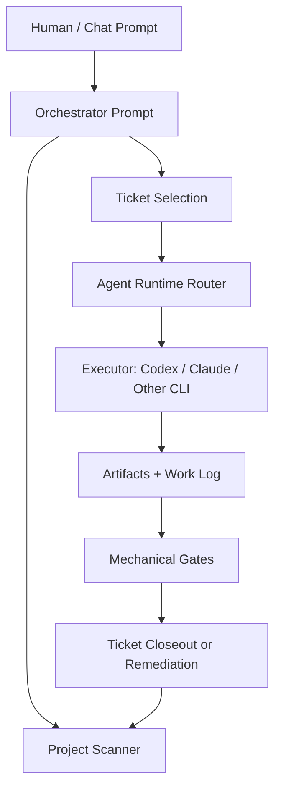

# Architecture

The platform is a file-backed operating system for autonomous work.

## Layers

## Durable Truth

The vault is the source of truth. Chat history is useful, but not trusted as the system of record.

Core durable objects:

- Project contracts and phase plans.
- Ticket frontmatter and work logs.
- Briefs, decisions, lessons, snapshots, and deliverable records.
- Gate reports and evidence paths.
- Control-plane state for active executors.

Snapshots are grouped by project on disk: `vault/snapshots/<project>/<file>.md` for platform projects, `vault/clients/<client>/snapshots/<project>/<file>.md` for client projects. Platform-level reports that aren't tied to a specific project (e.g., vault-status) live in `vault/snapshots/_platform/`. The operator inbox at `vault/snapshots/incoming/` is system-scoped and is not grouped.

Each project's derived context (current-context, artifact-index, image/video evidence indexes) lives in a `<slug>.derived/` sibling folder next to the canonical `<slug>.md`. These files are regenerable; the project markdown is the truth. See [vault/SCHEMA.md](../vault/SCHEMA.md) for the full layout and frontmatter contracts.

## Routing

`vault/config/platform.md` defines agents, strengths, and `task_type` routing.

The intended pattern is:

- Claude or another strong planner for orchestration, stakeholder communication, and visual judgment.
- Codex or another strong code agent for implementation, test generation, evidence audits, and mechanical quality gates.
- Other agents only for bounded tasks with clear failure modes.

The routing table is an operating policy, not a law of nature. Swap models and CLIs as economics/quality change.

## Gates

Gates turn "looks done" into "proved enough to close."

Common gate types:

- `check_quality_contract.py`
- `check_ticket_evidence.py`
- `check_brief_gate.py`
- `check_visual_gate.py`
- `check_stitch_gate.py`
- `check_wave_handoff.py`
- `check_phase_readiness.py`

The point is not bureaucracy. The point is recovery: after compaction or a crash, the next agent can see exactly why work passed, failed, or remains blocked.

## Recovery

The platform assumes interruption is normal.

Recovery state lives in:

- ticket frontmatter
- ticket work logs
- `data/control-plane/`
- evidence manifests
- brief and gate reports

An executor can disappear and the next cycle should still be able to answer:

- What was being attempted?
- What changed?
- What evidence exists?
- What gate failed?
- What is the next safe action?
