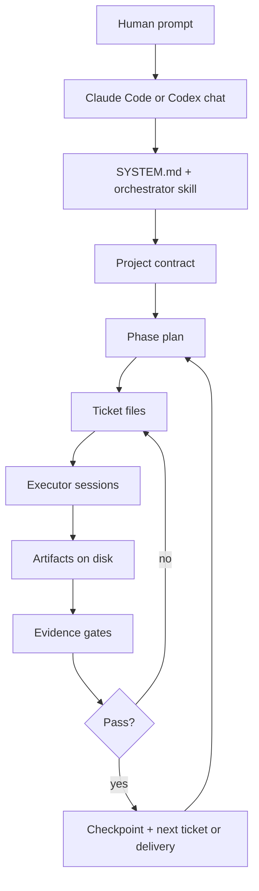

# OneShot Architecture

OneShot is a file-backed operating system for autonomous agent work. The README is the public front door; this document is the deeper map for people who want to understand the moving parts.

## Core Model

The important design choice is simple: chat is the interface, but disk is the source of truth. Agents can lose context, sessions can stop, and models can change without losing the project because the active state is written into markdown, YAML frontmatter, ledgers, evidence files, and snapshots.

## Runtime Boundaries

OneShot has two different surfaces:

- **Bootstrap CLI:** `oneshot` creates local config files from templates and checks whether Claude Code or Codex is available.
- **Project execution:** the user opens the repo in Claude Code or Codex and pastes a prompt. There is no hidden daemon and no `oneshot run` command.

That boundary keeps setup boring while leaving execution inside the AI coding tool the operator already uses.

## Durable Truth

The vault is the system of record. Chat memory can help, but it is not trusted as durable state.

Core durable objects:

- Project contracts and phase plans.
- Ticket frontmatter and work logs.
- Assumptions, decisions, lessons, snapshots, and deliverable records.
- Gate reports, evidence manifests, screenshots, command summaries, and review artifacts.
- Control-plane state for active executors.

Common paths:

- `vault/projects/<slug>.md`: canonical project log.
- `vault/projects/<slug>.derived/status.md`: quick status view regenerated from canonical files.
- `vault/projects/<slug>.derived/artifact-index.yaml`: project artifact index.
- `vault/tickets/T-XXX-*.md`: work orders and lifecycle state.
- `vault/snapshots/<project>/`: handoffs, gate reviews, evidence reports, and state captures.
- `vault/clients/<client>/`: isolated client workspaces.

Project-level snapshots are grouped by project on disk: `vault/snapshots/<project>/<file>.md` for platform projects and `vault/clients/<client>/snapshots/<project>/<file>.md` for client-scoped projects. Platform reports that are not tied to one project live in `vault/snapshots/_platform/`. Operator inbox material lands in `vault/snapshots/incoming/`.

See [vault/SCHEMA.md](../vault/SCHEMA.md) for frontmatter contracts and vault layout rules.

## Orchestration Loop

The orchestrator turns a prompt into a governed project:

1. Read `SYSTEM.md`, the orchestrator skill, and relevant vault context.
2. Write a goal contract with mission, assumptions, acceptance criteria, and proof shape.
3. Decide whether fresh research is required before architecture or tool choices.
4. Create a phase plan with exit criteria.
5. Create just-in-time tickets.
6. Route tickets to executor sessions.
7. Require evidence before closing work.
8. Write checkpoints so later sessions can resume.
9. Advance phases only after gate review.

Executors work one ticket at a time. They read context, make scoped changes, verify evidence, write a handoff, and update the ticket. They should not silently reshape the whole project.

## Tickets

Tickets are the coordination primitive. A ticket carries:

- Project link.
- Status and priority.
- Task type for routing.
- Blockers.
- Acceptance criteria.
- Work log.
- Evidence and handoff references.

This gives the system a small, inspectable unit of work. If a session stops, the next agent can read the ticket and continue without reconstructing the project from chat history.

## Gates

Gates turn "looks done" into "proved enough to close." A gate can require any evidence appropriate to the artifact:

- Files created or modified.
- Command output.
- Passing tests.
- Screenshots or walkthrough videos.
- Reports and review packets.
- Release verification.
- Clean-room model review.

Common helper scripts include:

- `check_quality_contract.py`
- `check_ticket_evidence.py`
- `check_brief_gate.py`
- `check_visual_gate.py`
- `check_stitch_gate.py`
- `check_wave_handoff.py`
- `check_phase_readiness.py`
- `build_claim_ledger.py`
- `verify_release.py`

The point is recovery and truthfulness. A failed gate records why work failed and routes it back to the executor. A passed gate gives the next session enough evidence to trust the state.

## Routing

Routing policy lives in `vault/config/platform.md`.

OneShot supports two main modes:

- **`chat_native` default:** orchestration, execution, and reviews run through the current host tool. Gates still use fresh context where possible.
- **`normal` opt-in:** routes work across configured tools, commonly Claude for orchestration and visual judgment, Codex for implementation, reviews, debugging, and mechanical proof.

The routing table uses `task_type` and semantic roles such as `gate_reviewer` or `visual_reviewer`. The table is policy, not hard law; operators can tune it as model quality and economics change.

## Recovery

Interruption is expected. Recovery state lives in:

- Ticket frontmatter.
- Ticket work logs.
- `ORCH-CHECKPOINT` entries in project logs.
- `data/control-plane/` ledgers.
- Evidence manifests.
- Gate reports.
- Derived status files.

After a context limit, crash, pause, or restart, the next session should be able to answer:

- What project is active?
- What phase is active?
- What ticket is next?
- What changed?
- What evidence exists?
- What failed?
- What is the next safe action?

The orchestrator includes a 20-iteration safety stop for loops with no progress. Productive runs can continue across many sessions because each meaningful step leaves state on disk.

## Self-Extension

OneShot can add capabilities when the project needs them. The sourcing cascade is:

1. Search for an existing skill.
2. Search GitHub or MCP registries for an existing MCP server.
3. Reuse sanitized internal archive material.
4. Build a new MCP server, skill, script, or helper from scratch.

Successful capabilities can be sanitized and archived under `vault/archive/` so future projects start with more tools available.

Bundled platform MCPs live under `vault/clients/_platform/mcps/`. The spending MCP is the budget-control layer for paid APIs. Other wrappers cover optional integrations such as calendars, maps, search-console data, image comparison, image generation, transcription, SEC filings, semantic search, and Webflow.

## Workspace Isolation

Client-scoped work lives under `vault/clients/<slug>/` with separate:

- Projects.
- Tickets.
- Snapshots.
- Decisions.
- Lessons.
- Workspace-specific MCPs and skills.
- Config, payment, and budget state.

Agents must not cross client boundaries unless a task explicitly authorizes it. Platform work lives in the top-level `vault/projects/`, `vault/tickets/`, and `vault/snapshots/` areas.

## Safety And Cost

OneShot assumes agents may run commands, write files, and call configured APIs. Safety comes from least-privilege configuration plus evidence gates, not from pretending the surface is small.

Important expectations:

- Keep credentials out of git.
- Use restricted API keys.
- Configure spending limits before paid API access.
- Treat third-party code as untrusted until inspected.
- Keep optional payment rails disabled unless deliberately reviewed.
- Expect high token use for serious projects because build, review, proof, and recovery all consume model calls.

## Why The Architecture Is File-Backed

Long projects fail when the only state is chat history. OneShot writes the project to disk so the next agent can verify before acting, continue after interruption, and disagree with stale chat memory when the filesystem proves otherwise.
